# User Graphical Human Interface

- Note: Interface has changed from original design: instead of having a Task History button on each task list page, we chose to add that navigation to the Nav bar instead.
- Additionally, while we still plan to incorporate a filter button, that currently has not been implemented (as of 9/3/24).

## Home Page / Signin Page

Because the user needs to be signed in to view each of the pages, the home page automatically redirects to the signin page.

The signin page contains an "About Us" section, giving the user information about the app, as well as a form to sign in.

There is also a link to sign up for an account (if the user does not already have one). Clicking the link navigates the user to the Sign Up page.

## Sign Up Page

The sign up page is where the user can create an account. The form will prompt the user to input their first and last name, their email, create a password, and create a username.

All fields are required, and the email and username must be unique for each user.

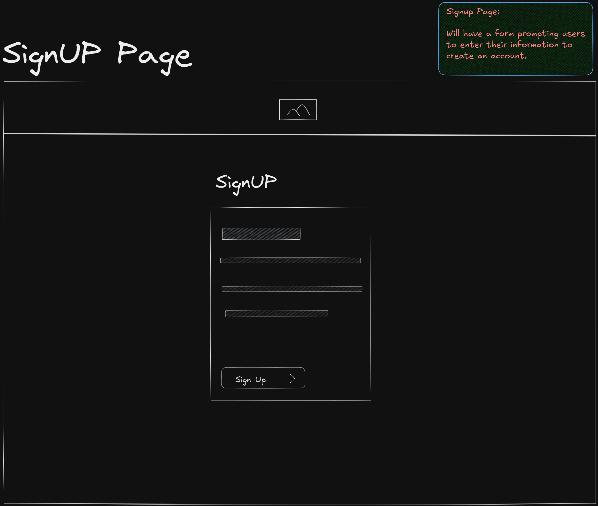

## Dashboard

The user will automatically be redirected to their Dashboard upon signing in (or signing up).

The Dashboard displays a welcome message, along with a motivational quote (that is random each time the page is refreshed).

Additionally, the Dashboard shows the users top priority tasks (both from tasks they have created and tasks that they have been assigned).
Each list shows the top 5 tasks (sorted by due date first, and then by priority level).
Each list only includes tasks that either have a status of "Active" or "In Progress".

The task card will show the task title, the task due date, the task priority level, and either the task assignee or assigner (depending on if the user created or was assigned the task)

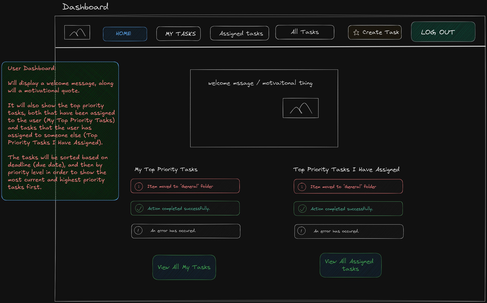

## All Tasks Page

Shows all of the tasks that have been created, that have a status of "Active" or "In Progress". The list sorts tasks based on due date, and then by priority level.

The user does not have to be the assigner (task creator) OR the assignee of a task in order to view the list of all tasks.

The task card will show the task title, the task assignee and assigner, the task due date, and the task priority level.

Users can search the list of all tasks by task title, which will filter the list to show only those tasks matching the search query.

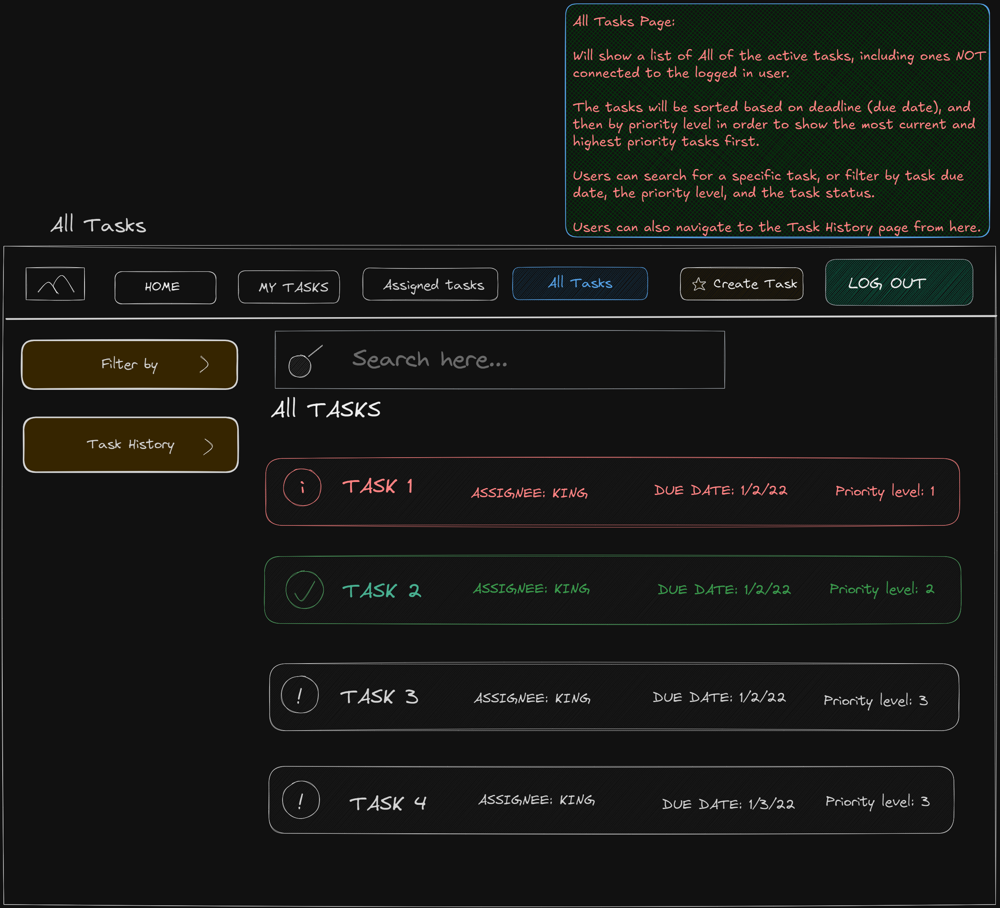

## My Created Tasks Page

Shows all of the tasks that the signed in user has created, that have a status of "Active" or "In Progress". The list sorts tasks based on due date, and then by priority level.

The user must be the assigner of a task (task creator) in order for the task to show on this page.

The task card will show the task title, the task assignee, the task due date, and the task priority level.

Users can search the list of all tasks by task title, which will filter the list to show only those tasks matching the search query.

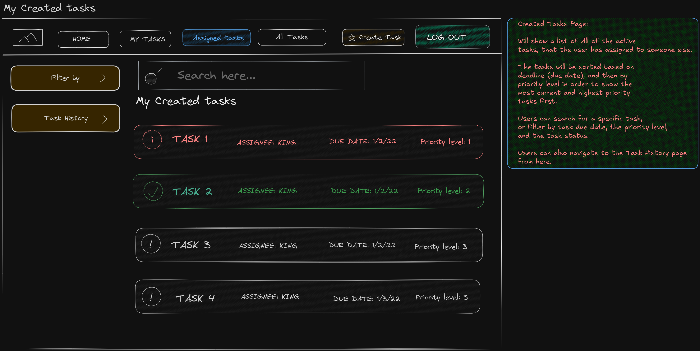

## My Assigned Tasks Page

Shows all of the tasks that the signed in user has been assigned, that have a status of "Active" or "In Progress". The list sorts tasks based on due date, and then by priority level.

The user must be the assignee of a task in order for the task to show on this page.

The task card will show the task title, the task assigner, the task due date, and the task priority level.

Users can search the list of all tasks by task title, which will filter the list to show only those tasks matching the search query.

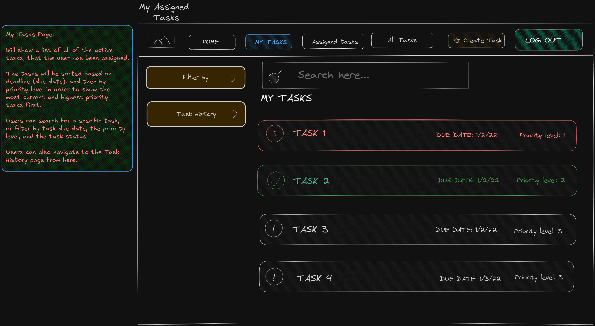

## Task History Page

Shows all of the tasks that have been created, that have a status of "Completed" or "Deleted". The list sorts tasks based on due date, and then by priority level.

A user does not have to be the assigner (task creator) OR the assignee of a task in order to view the task history list.

The task card will show the task title, the task assigner and assignee, the task due date, and the task priority level.

Users can search the list of all tasks by task title, which will filter the list to show only those tasks matching the search query.

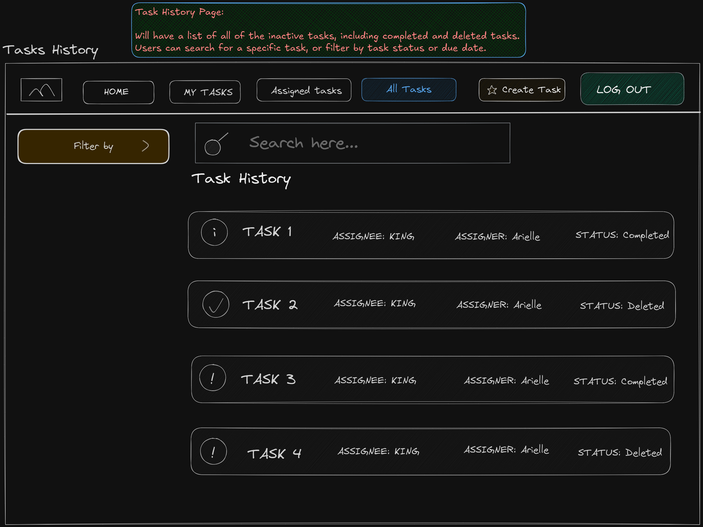

## Create Task Page

Any user can create a task. This page contains a form that prompts the user to fill input the task title, the task description, the due date, the priority level, and choose the assignee for the task.

All fields except for the task description are required, and the user is able to assign the task to themselves if they choose.

The task assigner will automatically be set as the signed in user creating the task, and the task status will be set to the default of "Active". Additionally, the task's created_on property will be automatically set as the timestamp of when the task is created.

Submitting the form redirects the user to their Dashboard.

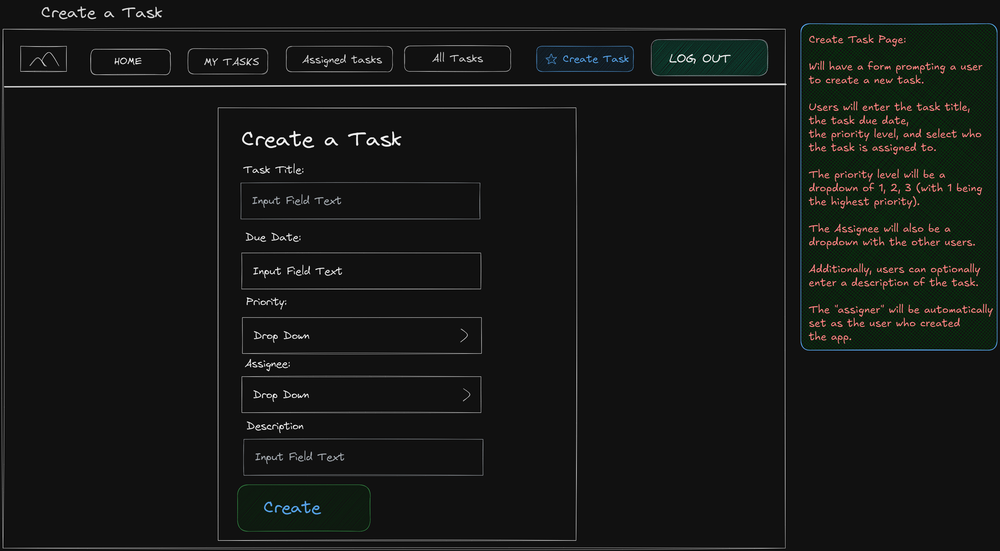

## Task Detail Page

To view the details of a specific task: users can click on any task card from any task list (such as All Tasks, My Created Tasks, My Assigned Tasks, Task History, and Dashboard).

The user does not have to be associated with the task (the task assigner or assignee) in order to view the task details; however, they will be unable to edit the task in any way.

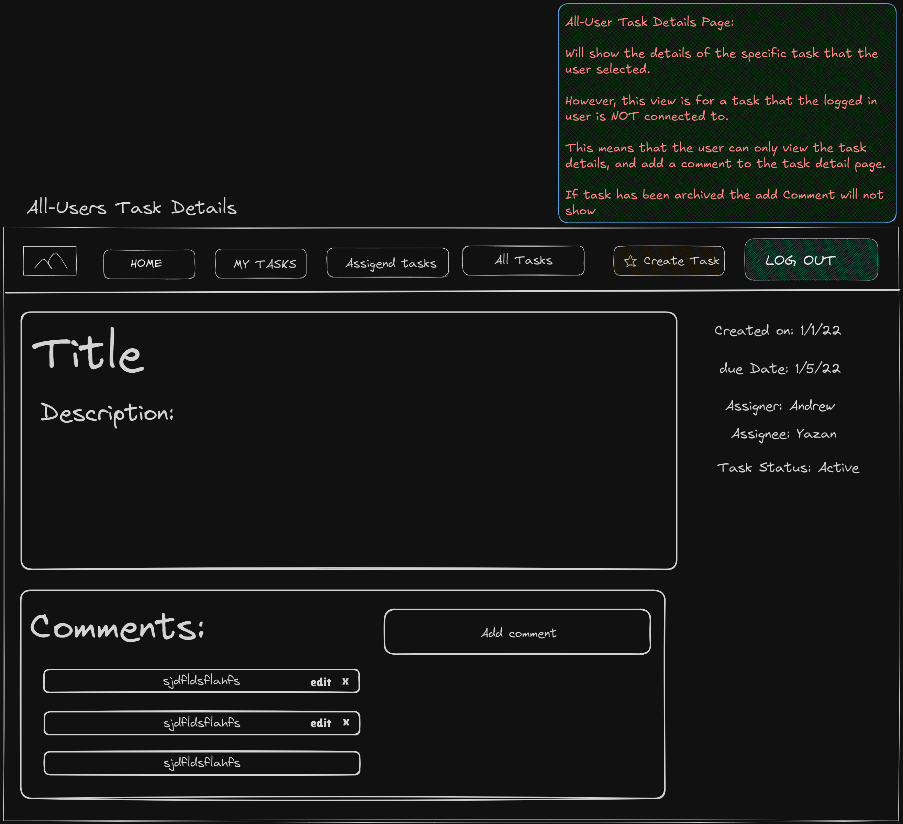

- If the user is the assignee of the task:
    - They will be able to edit the status of the task.
    - They will see an "In Progress" button that will change the task status from "Active" to "In Progress" when clicked.
    - They will also be able to mark the task "Completed" by clicking the "Complete" button. Clicking the "Complete" button will also cause the joke modal to display.

The assignee will not be able to edit any other properties of the task.

- If the user is the assigner of the task:
    - They will be able to edit the task freely.
    - They can also change the status of the task by clicking the "In Progress", "Complete", or "Delete" buttons.
    - Additionally, the assigner will be able to edit other properties of the task by clicking the "Edit Task" button, which will navigate the user to the Edit Task page.
    - However, the assigner will only be able to edit the properties that a user can initially input when creating the task.

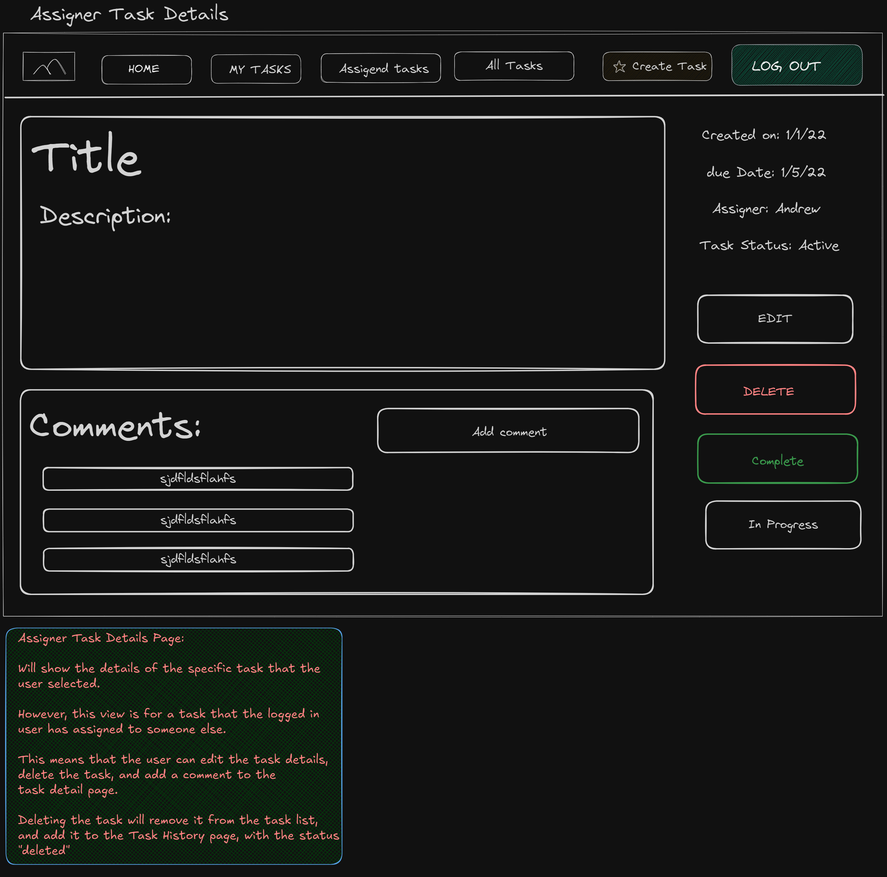

For both the assigner and the assignee: the "In Progress" button will only show if the task does not already have a status of "In Progress"

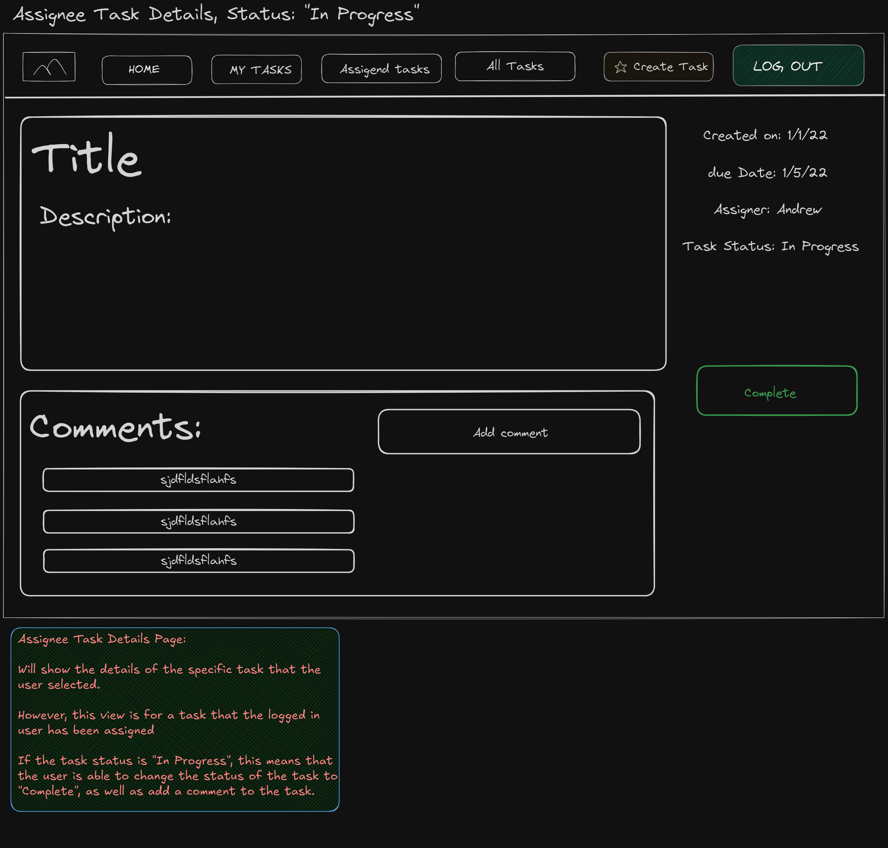

Additionally:
- tasks that have a status of completed will NOT show the "Complete" or "Delete" buttons (as you cannot delete a completed task)
- tasks that have been marked "Completed" or "Deleted" will NOT show the edit button (as you cannot edit an already completed / deleted task)
- tasks can be reactivated if marked "Completed" or "Deleted" by changing the status back to "In Progress", which will then allow the edit button to show.

Clicking the buttons do not navigate away from the task detail page, but will show the task details with the updated status.

## Edit Task Page

Only the assigner of a task (the task creator) can edit a task. This page contains a form that prompts the user to fill input the task title, the task description, the due date, the priority level, and choose the assignee for the task.

All fields except for the task description are required, and the user is able to assign the task to themselves if they choose.

The user cannot change the assigner of the task, the created_on property, or the status of the task through the edit form.

Submitting the form redirects the user back to the task details of the task that they edited.

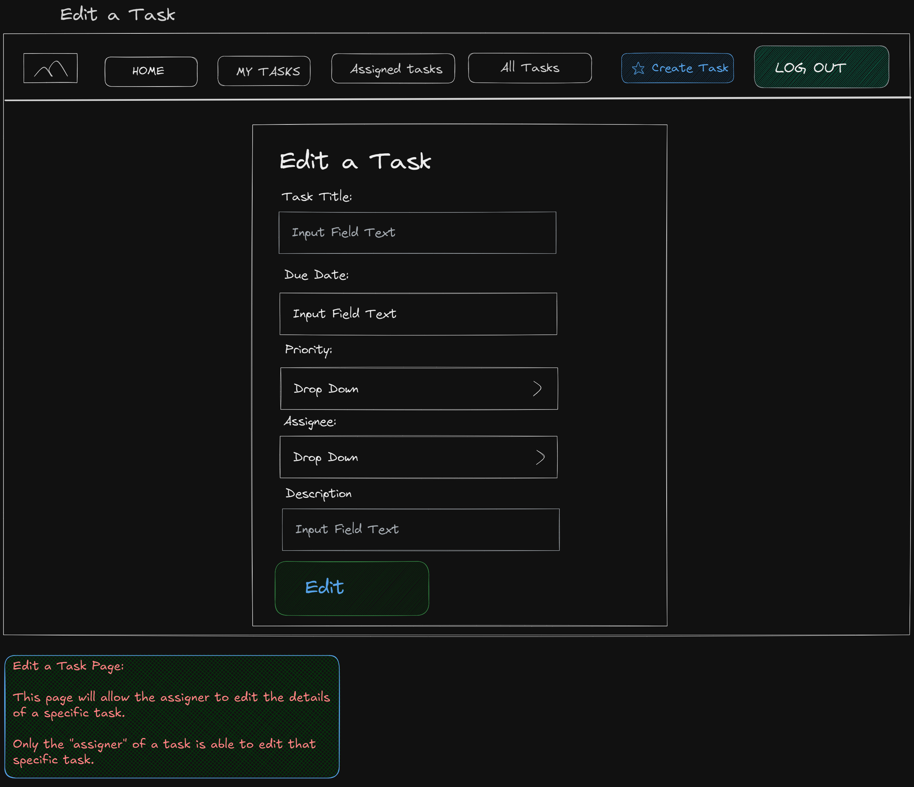

## Add / Edit Comment Modal

Any user is able to add a comment to any task (even if they are not the task assigner or task assignee).

On each task detail page, the comments associated with that task show (with the most recent at the top).

Clicking the "Add Comment" button prompts a modal to show, where the user can input the content of the comment. Submitting the form will close the modal, and show the task detail page (with the new comment displayed).

Users can only edit or delete the comments that they have created, which is shown by the edit and delete icons on those specific comments.

Clicking the edit icon will display a modal with the original comment filled in, and the user can edit the comment content as desired. Submitting the form will close the modal, and show the task detail page (with the newly edited comment display).

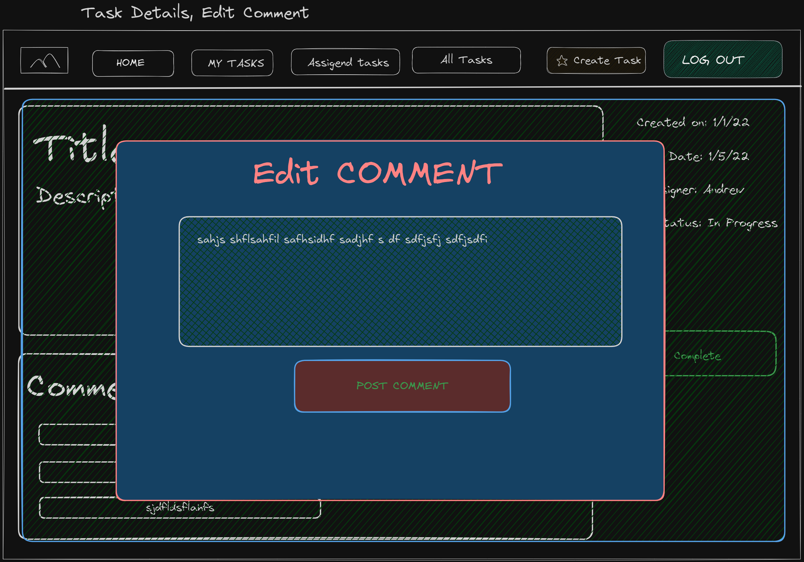

Clicking the delete icon will display a modal confirming the user's choice to delete the comment. Clicking "yes" deletes the comment from the database, and shows the task detail page with the deleted comment removed.

## Joke Modal

When the assigner or assignee of a task mark the task completed (by clicking the "Complete" button), a modal will be displayed that shows a random joke. Additionally, confetti will show on the page.

Closing the joke modal will redirect the user to their dashboard.

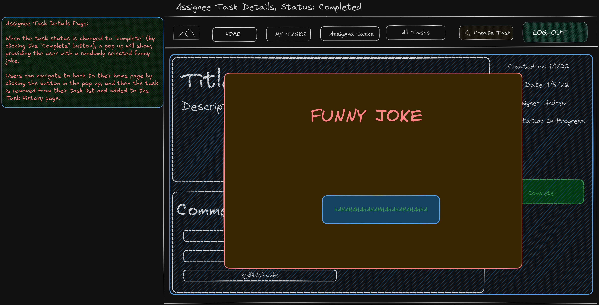
